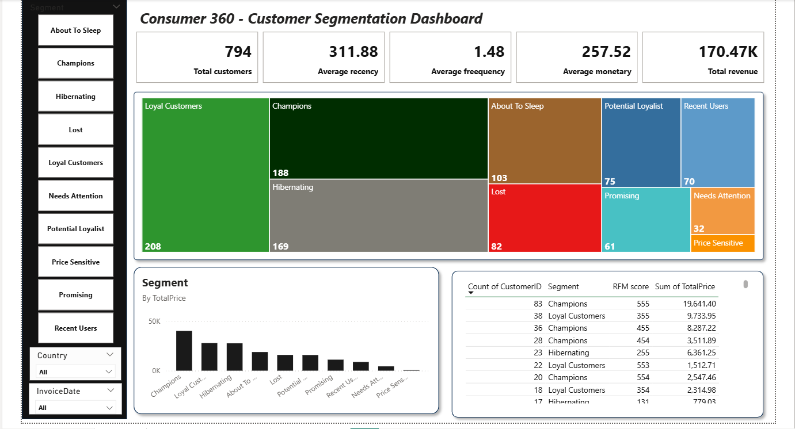

# Customer 360: Customer Segmentation & RFM Analysis (Data Analytics Project)

## Project Overview
This project analyzes retail transaction data to understand customer purchasing behavior using *RFM (Recency, Frequency, Monetary) analysis*.

The goal of the project is to segment customers into meaningful groups such as *Champions, Loyal Customers, Potential Loyalists, and At-Risk Customers* and visualize these insights through an interactive *Power BI dashboard*.

The project demonstrates how customer transaction data can be processed using *Python, SQL, and Power BI* to generate actionable business insights

---

## Tools & Technologies
- *Python* – Data preprocessing and RFM calculation
- *SQL  (MySQL)* – Data cleaning and analytics queries
- *Power BI* – Data visualization and dashboard creation.
  
---

## Dataset

The dataset contains retail transaction data used to analyze customer purchasing behavior.

### Dataset Fields
- CustomerID – Unique customer identifier
- InvoiceNo – Transaction identifier
- InvoiceDate – Date of purchase
- Quantity – Number of products purchased
- UnitPrice – Price per product
- TotalPrice – Total purchase amount
- Country – Customer location

---

## Data Processing Steps

### 1. Data Cleaning (SQL)
SQL was used to perform basic data quality checks:

- Duplicate record detection
- Null value handling
- Transaction validation
- Customer-level aggregation

---

### 2. RFM Calculation (Python)

Customer value was calculated using three metrics:

*Recency*
Days since the customer's last purchase.

*Frequency*
Number of purchases made by the customer.

*Monetary*
Total amount spent by the customer.

These values were converted into *RFM scores (1–5)* to evaluate customer behavior.

---

### 3. Customer Segmentation

Customers were segmented based on RFM scores into groups such as:

- Champions
- Loyal Customers
- Potential Loyalists
- Promising
- Recent Users
- Needs Attention
- About To Sleep
- Hibernating
- Lost
- Price Sensitive

These segments help businesses identify *high-value customers and potential churn risks*.

---

### Dashboard Visuals

1. *Customer Segmentation Treemap* – Distribution of customers across segments  
2. *Revenue by Segment* – Revenue contribution by each customer group  
3. *Revenue Trend Over Time* – Customer purchasing patterns across time  
4. *RFM Contribution Analysis (Decomposition Tree)* – Revenue analysis based on RFM scores  
5. *Customer RFM Detail Table* – Detailed RFM metrics for each customer  

---

## Dashboard Preview

---

## Key Insights

- Champions and Loyal Customers generate the highest revenue.
- Hibernating and Lost customers indicate potential churn risk.
- Loyal customers have the highest purchase frequency.
- Revenue patterns vary across time.

These insights help businesses improve *customer retention strategies and targeted marketing campaigns*.

---

